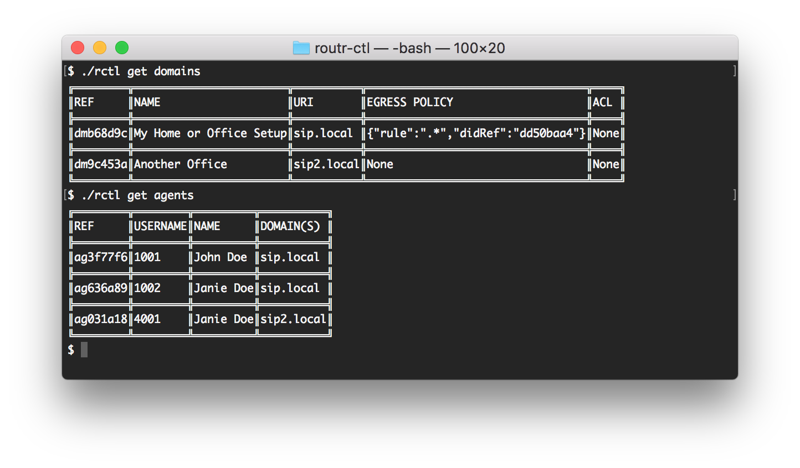
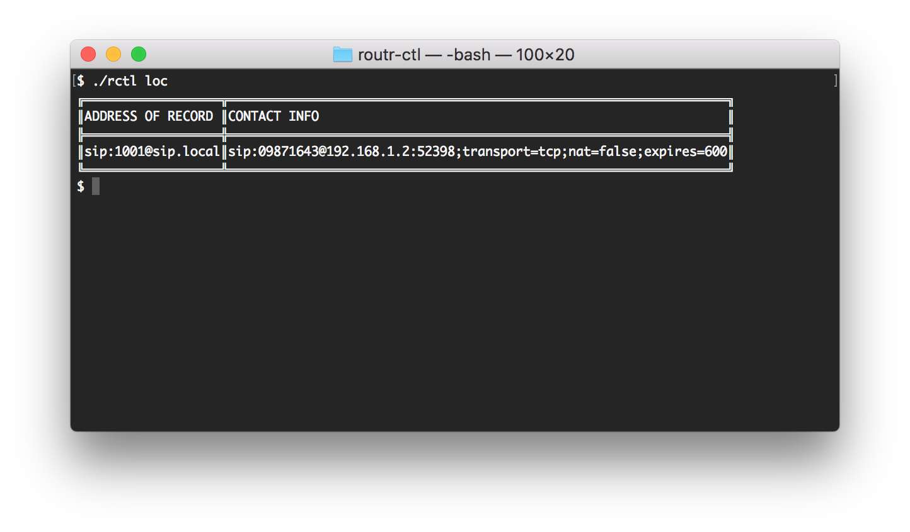
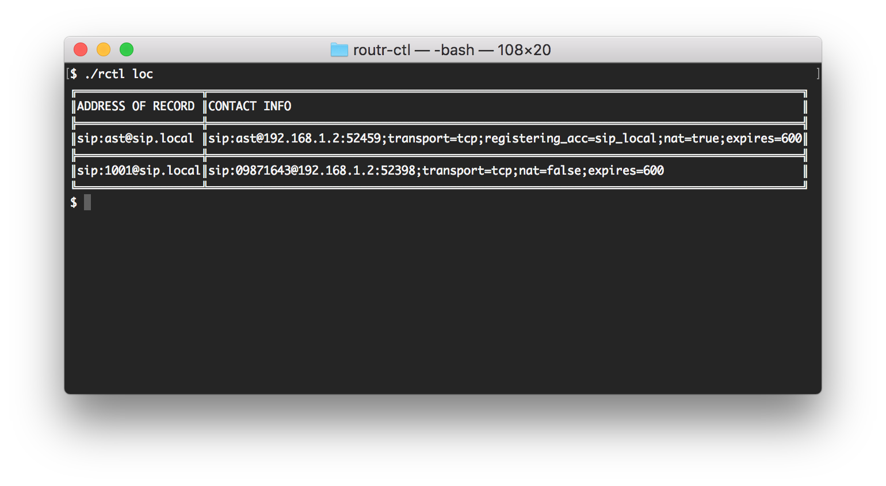

This guide explores the use case of using Asterisk merely as a Media Server and a more specialized software, like **Arke**, to take care of the signaling and resource management. In other words, Asterisk will be in charge of the ivrs, voice mail, call recording, and **Arke** will deal with connecting Agents, Peers, and Gateways. The following illustration depicts our scenario:


**Content**

- [Requirements](#requirements)
- [Configuration Overview](#configuration-overview)
- [Configuring Asterisk](#configuring-asterisk)
- [Calling Asterisk from John’s device](#calling-asterisk-from-johns-device)
- [What’s Next?](#whats-next)

## Requirements

This tutorial assumes the following:

- You have a SIP phone connected to the same LAN where Arke and Asterisk are in.
- If using a hardware phone, this can reach Asterisk and Arke and the other way around
- You have a fresh installation of Arke and Asterisk

> Before starting this guide make sure to have a fresh installation of **Arke** server.

## Configuration Overview

With a fresh installation of **Arke** you will have most of the configuration you need to follow this tutorial. We, however, need to make some minor changes to configuration files to run our scenario.

The first file we will examine and change is `config/peers.yml`. Make note of the username and secret for the Peer "ast" since we will be using this to configure Asterisk. Also, search for the field `spec.device` and change it to match the Agents domain(`sip.local`). The file now will look similar to this:

`config/peers.yml`

```yml
- apiVersion: v1beta1
  kind: Peer
  metadata:
    name: Asterisk PBX
  spec:
    device: 'sip.local'
    credentials:
      username: ast
      secret: '1234'
```

Head to the console and run the command `arkctl -- get peers` to confirm that the Peer exist. The result should be as follows:


Next, we focus our attention to `domains.yml` and `agents.yml`. With a fresh installation, we don't need to make any changes to this files. However, you could run the commands `get domains` and `get agents` to ensure that both, the Agent and the Domain, exist on the server. Your output should look similar to:



Use the information in `agents.yml` to configure your SIP phone. The relevant information is found in `spec.credentials`. Mine looks like this:


> Make the adjustments based on your prefer SIP phone.

You can verify that your device registered correctly with **Arke** by running the `locate` command:



## Configuring Asterisk

**Using PJSIP**

Backup your `pjsip.conf` and `pjsip_wizard.conf`. Update your pjsip.conf with the following:

```
[transport-tcp]
type=transport
protocol=tcp
bind=0.0.0.0:6060
```

Then, in your pjsip_wizard.conf:

```
[arke]
type = wizard
sends_auth = yes
sends_registrations = yes
remote_hosts = 192.168.1.2
outbound_auth/username = ast
outbound_auth/password = 1234
registration/retry_interval = 10
registration/expiration = 900
endpoint/allow = ulaw
endpoint/allow = alaw
endpoint/allow = opus
endpoint/context = default
transport = transport-tcp
```

**Using the "old" Chan SIP**

First backup your `sip.conf`. Then, replace your configuration and edit the file to reflect the following:

```
[general]
udpbindaddr=0.0.0.0:6060
context=default
register => ast:1234@192.168.1.2:5060/1001    ; This information must match the credentials in `config/peers.yml`
```

**Configuring the Dialplan**

We are going to use a very simple dialplan to play a sound file. Again, make a backup of your configuration and replace its content with this:

```
[default]
exten => 1001,1,Answer
exten => 1001,n,Playback(tt-monkeys)
exten => 1001,n,Hangup
```

Restart your Asterisk and check the location service. A new device will appear.



## Calling Asterisk from John's device

We can now call `ast@sip.local` and if everything went well listen to a group of really annoying monkeys :).

## What’s Next?

You can check out the [wiki](https://github.com/fonoster../wiki/Home) to see more examples. If you have any questions start an issue or contact us via:

- Twitter: [@fonoster](https://twitter.com/fonoster)
- Email: fonosterteam@fonoster.com
