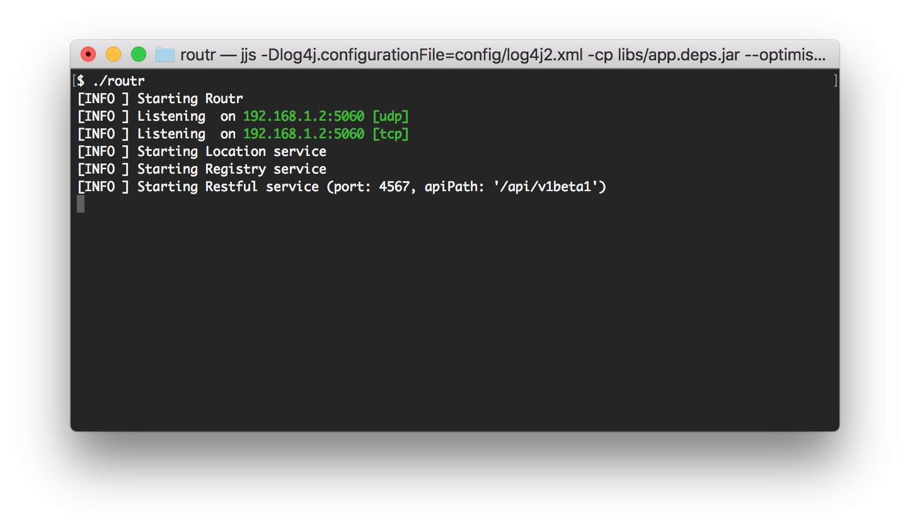
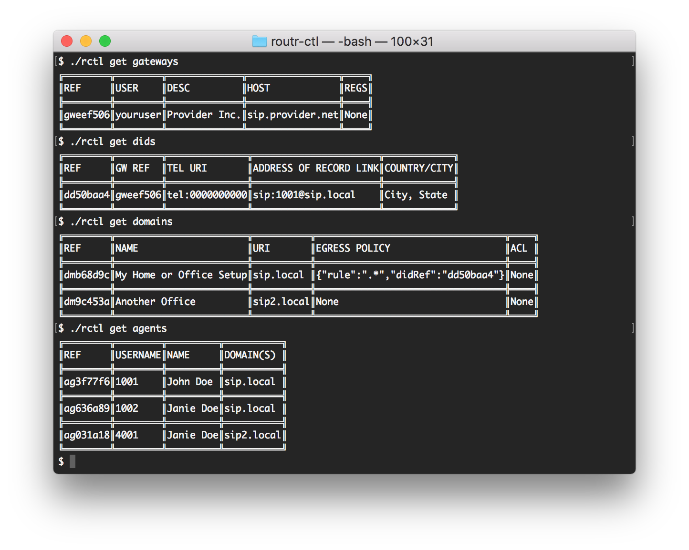
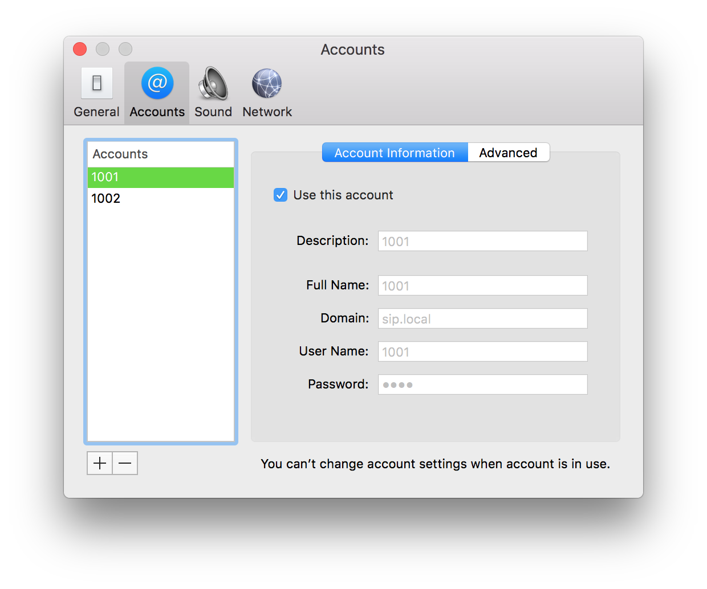
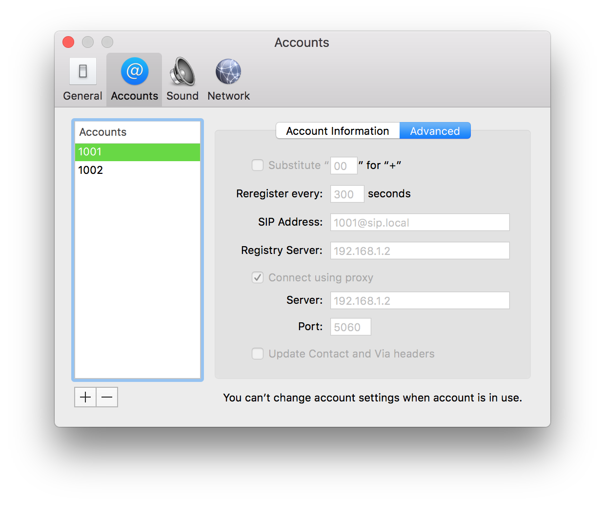
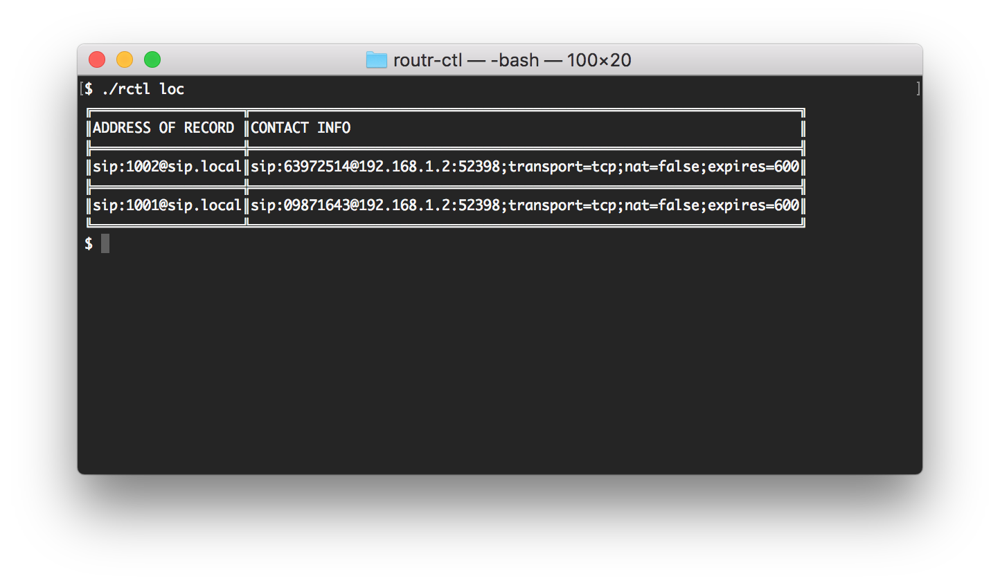

This is a step-by-step guide on VoIP setup at home or at the office. For calls to the PSTN you will need to have a sip provider like `voip.ms` or `didlogic.com`.

**Content**

- [Requirements](#requirements)
- [Setting up the Server](#setting-up-the-server)
    - [Configuring the Gateway](#configuring-the-gateway)
    - [Configuring the DID ](#configuring-the-did)
    - [Creating a new Domain and EgressPolicy](#creating-a-new-domain-and-egresspolicy)
    - [Creating the Agents](#creating-the-agents)
- [Configuring the Sip devices](#configuring-the-sip-devices)
- [Making calls](#making-calls)
- [What's Next](whats-next)

## Requirements

This tutorial assumes the following:

- Two SIP phones connected to the same LAN
- A fresh installation of Arke
- SIP providers such as `voip.ms` or `didlogic.com`

## Setting up the Server

A set of sample configuration converting this scenario can be found at [basic sample files](https://github.com/fonoster../tree/master/config/samples/basic_setup). You might overwrite the files in the `config` folder if you wish to skip this section.

### Configuring the Gateway

To configure the Gateway you must consult your sip provider and obtain the credentials and `registration host`. The key fields for the configuration are `metadata.ref`, `spec.regService.host` and `spec.regService.credentials`. Here is an example:

```yml
- apiVersion: v1beta1
  kind: Gateway
  metadata:
    name: Provider Inc
  spec:
    regService:
      host: sip.provider.net
      credentials:
        username: 'youruser'
        secret: 'yoursecret'
      transport: udp
```

### Configuring the DID

To configure your DID or virtual number, you must open and edit the file `config/dids.yml`. Notice in the example below, how your reference the Gateway by using the field `metadata.geRef`. The key field while configuring DIDs are `spec.location.telUrl` and `spec.location.aorLink`. Keep in mind that the value in `spec.location.telUrl` must be formatted exactly as sent by the provider.

```yml
- apiVersion: v1beta1
  kind: DID
  metadata:
    gwRef: gweef506
    geoInfo:
      city: Columbus, GA
      country: USA
      countryISOCode: US
  spec:
    location:
      telUrl: 'tel:17066041487'
      aorLink: 'sip:1001@sip.local'
```

### Creating a new Domain and EgressPolicy

**Arke** is a Domain centric Sip Server. A Domain is used to group several Agents in the same context. The Domain URI can be an arbitrary name but we recommend using a fully qualified domain name (FQDN). You will also need to setup and *EgressPolicy* to allow calls outside the Domain. Here is how the file `config/domains.yml` needs to look like:

```yml
- apiVersion: v1beta1
  kind: Domain
  metadata:
    name: Local Office
  spec:
    context:
      domainUri: sip.local
      egressPolicy:
        rule: .*
        didRef: dd50baa4
```

### Creating the Agents

We will now create the Agents `1001` and `1002`. Keep in mind that field `spec.credentials.username` can be alphanumeric, so `john` or `john001` is also acceptable.

Pay close attention to the credentials block since it contains the username and secret for both Agents.

```yml
- apiVersion: v1beta1
  kind: Agent
  metadata:
    name: John Doe
  spec:
    credentials:
      username: '1001'
      secret: '1234'
    domains: [sip.local]
- apiVersion: v1beta1
  kind: Agent
  metadata:
    name: Janie Doe
  spec:
    credentials:
      username: '1002'
      secret: '1234'
    domains: [sip.local]
```

To verify your configuration, start the server by issuing the command `arke`. In a separate window use the following commands:

- `arkectl get gateway`
- `arkectl get did`
- `arkectl get domain`
- `arkectl get agents`

Your output should be as follows:

**Starting the Server**



**Verifying the Configuration**



## Configuring the Sip devices

> We are using "Telephone" for this example. You might use any softphone you wish, just keep in mind that the configuration will look slightly different.

Configure your softphone using the information you gather in the last step. Start by completing only the required information: _username_, _domain_, _password_. Also, In the advanced section use the server's **IP** as your _Registry Server_ and _Proxy_. Here is how mine looks like:




> Make sure to check the box "Use this account" to register your device

If everything went well we just need to confirm that both softphones have registered correctly. Conveniently you can use the `.arkectl locate` to obtain a list of "online" devices. This may seem like a lot of information. But what's relevant here is that both `1001` and `1002` are present in the location service and therefore can reach each other.



## Making calls

This is a pretty easy step. If everything went well you will be able to call devices inside and outside your domain. Simply use the destination URI (eg.: 1001@sip.local or 7853178060@sip.local).

## What’s Next?

You can check out the [wiki](https://github.com/fonoster../wiki/Home) to see more examples. If you have any questions start an issue or contact us via:

- Twitter: [@fonoster](https://twitter.com/fonoster)
- Email: fonosterteam@fonoster.com
